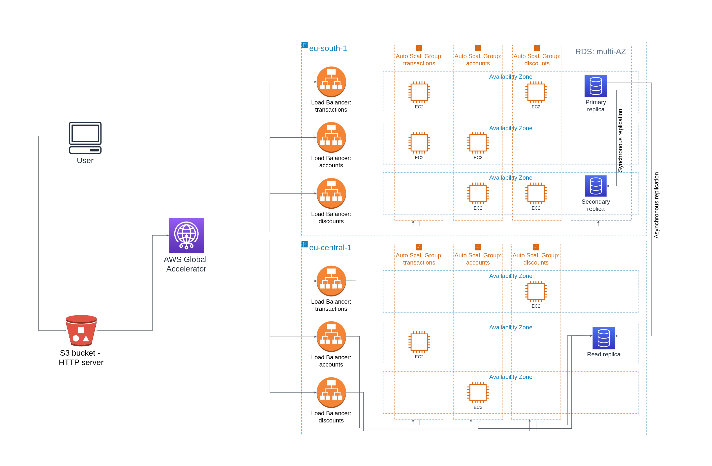
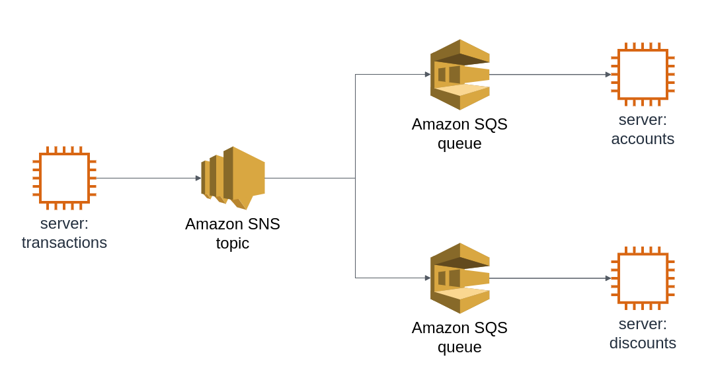
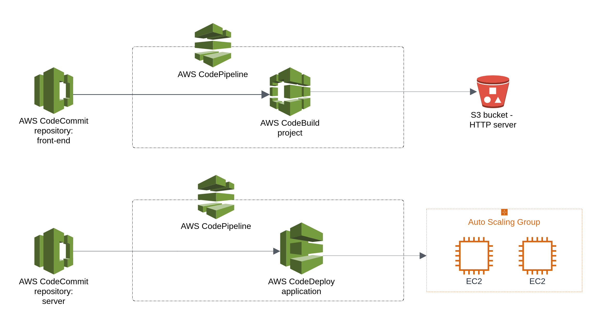

# HighAvailabilityOnAWS

This project aims to exploit high availability solutions provided by AWS and gather them in a single system. It contains the most common infrastructure elements of a production system, such as load balancers, automatic scaling and database replication.

All infrastructure needed for the system is managed via Terraform, with small number of exceptions, introduced mostly in order to limit the overall infrastructure cost.

## Project description
### System infrastructure



This project provides infrastructure for an system with front-end layer, three server microservices and a Postgres database.

For the front-end files, an S3 bucket is prepared with a static file hosting option enabled. Servers and database run in two regions: eu-south-1 (primary) and eu-central-1 (recovery).

In each region, each of the 3 servers runs on EC2 instances within an Auto Scaling Group, fronted by an Application Load Balancer. In the primary region, there are two replicas of the database. Data is replicated synchronously between these replicas, all queries are handled by the primary replica. In case of a failure of the primary replica, secondary one automatically starts handling queries. In the recovery region runs third replica with the ability to handle read queries and supply data to the server instances in this region. Data is replicated asynchronously to this replica.

User traffic is routed between regions by AWS Global Accelerator. By default, all traffic is routed to the main region, however in case of a server failure traffic to each server can be independently routed to the recovery region.

### Communication infrastructure



System uses asynchronous communication taking advantage of message brokers. The communication flow can be seen on the figure above.

### CI/CD infrastructure



CI/CD infrastructure is provided in this project in a way shown on the figure above. New version of each software part of the system (front-end, each of the 3 servers) can be deployed independently and automatically after pushing changes into the corresponding repository.


## Project usage

In order to run this project succesfully, one need to provide appropriate values for all the variables contained in the `locals` blocks in `modules/server/main.tf` and `modules/database/main.tf` files.

`modules/server/main.tf`
```
locals {
  primary_region_vpc_id             = "<VPC ID>"
  primary_region_subnet_ids         = "<List of subnet IDs in VPC>"
  primary_region_ubuntu_node_ami_id = "<AMI ID in VPC>"
  primary_region_instance_type      = "<Instance type>"
  primary_region_ssh_key_name       = "<SSH key name>"

  recovery_region_vpc_id             = "<VPC ID>"
  recovery_region_subnet_ids         = "<List of subnet IDs in VPC>"
  recovery_region_ubuntu_node_ami_id = "<AMI ID in VPC>"
  recovery_region_instance_type      = "<Instance type>"
  recovery_region_ssh_key_name       = "<SSH key name>"
}
```

`modules/database/main.tf`
```
locals {
  primary_region_vpc_id  = "<VPC ID>"
  recovery_region_vpc_id = "<VPC ID>"
}
```

After providing these values project should run succesfully with
```
terraform init
terraform apply
```

*Note: project is set to run in the `eu-south-1` and `eu-central-1` regions. In order to change this, one need to modify `terraform.tfvars` file.*
